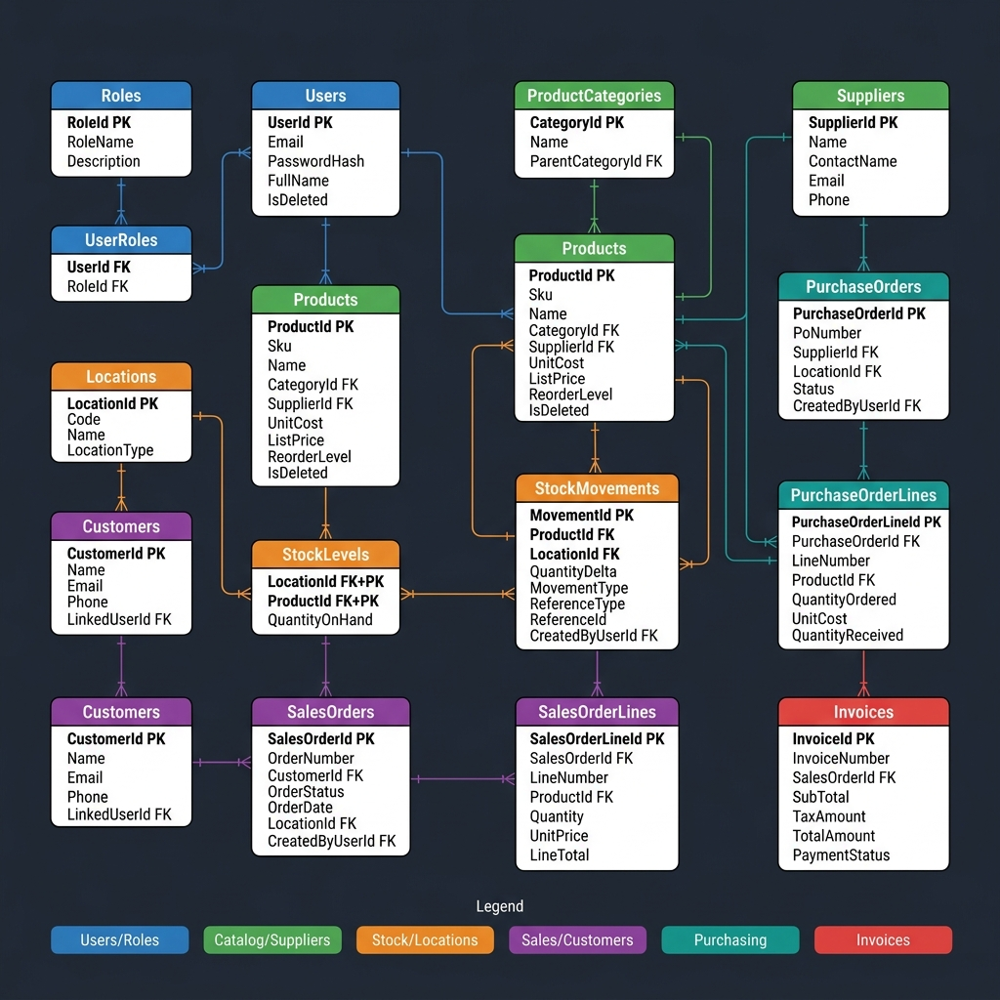
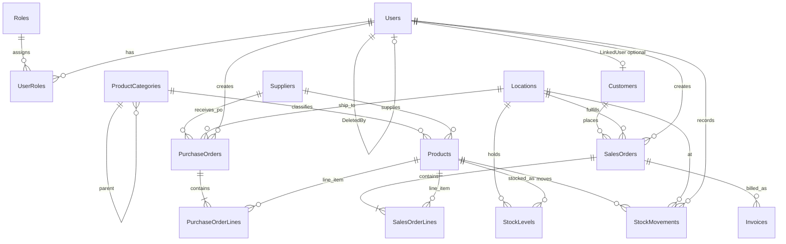

# 3. Entity-relationship diagram (ERD)

## Diagram

> Mermaid source below — paste into [Mermaid Live](https://mermaid.live) or export to PNG/PDF for your submission if your instructor requires a standalone diagram file.

## Relationship summary

| Relationship | Cardinality | Notes |
|--------------|-------------|--------|
| Users — UserRoles — Roles | M:N | RBAC |
| Products — ProductCategories | N:1 | Optional parent category self-FK |
| StockLevels | (Location, Product) | Composite PK |
| StockMovements | Many per product/location | Ledger |
| SalesOrders — SalesOrderLines | 1:N | |
| PurchaseOrders — PurchaseOrderLines | 1:N | |

For the **warehouse** star schema, see [`inventory/warehouse/star_schema_ddl.sql`](../inventory/warehouse/star_schema_ddl.sql) (facts and dimensions).
